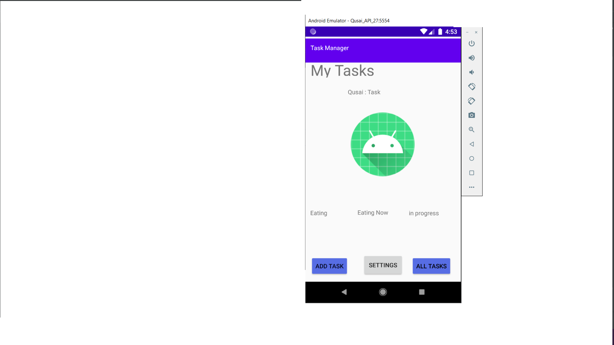
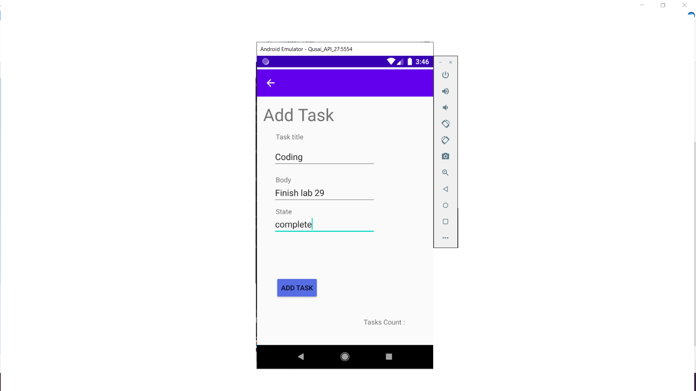
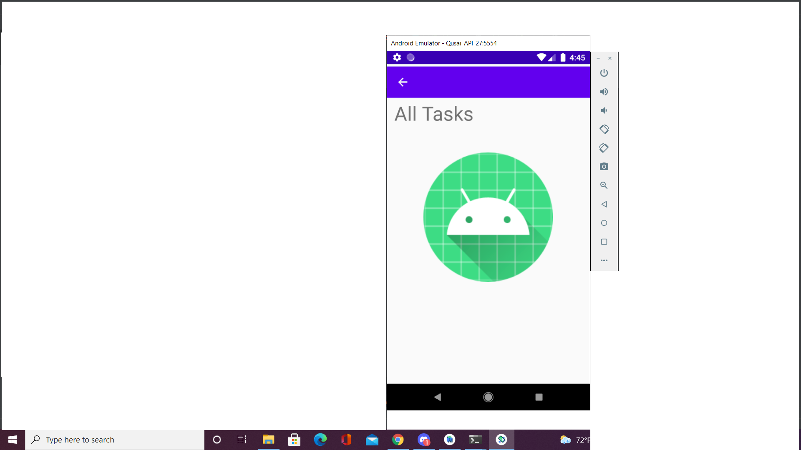
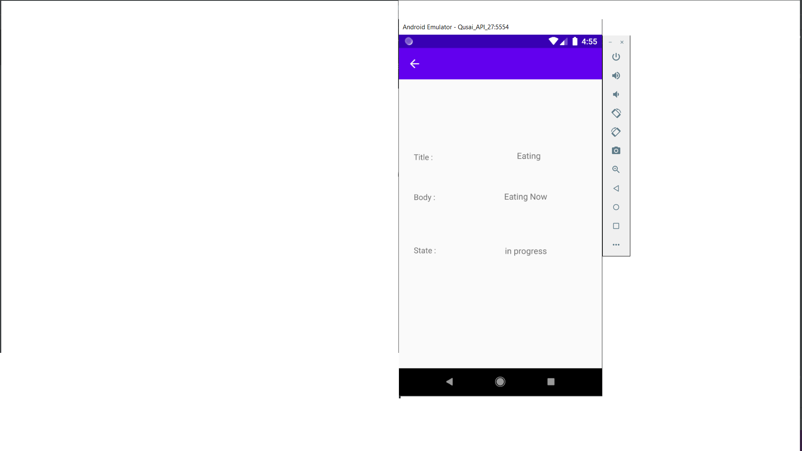
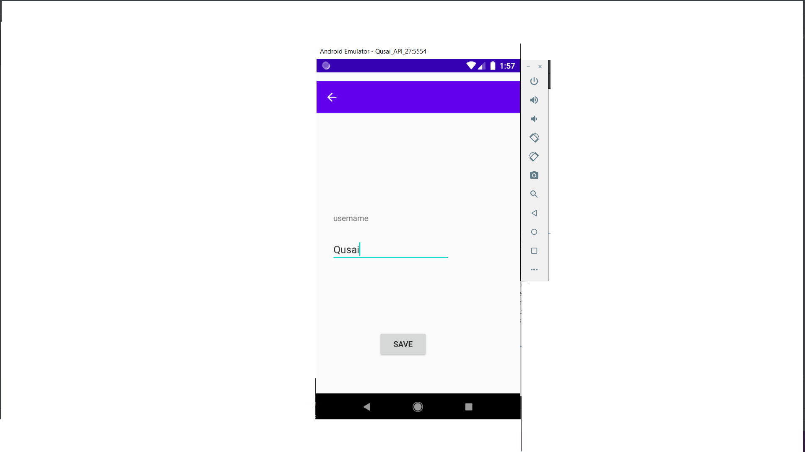
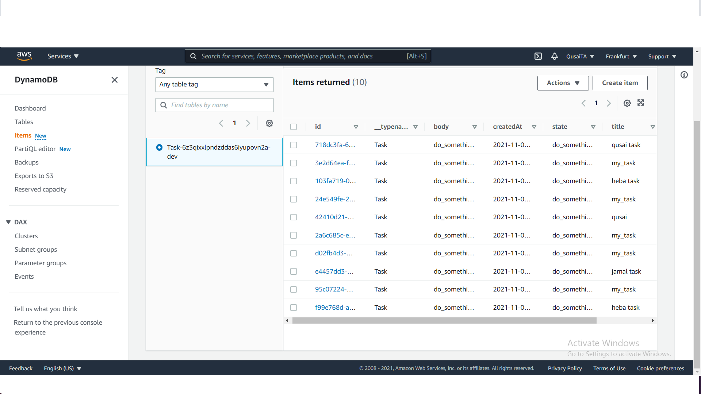
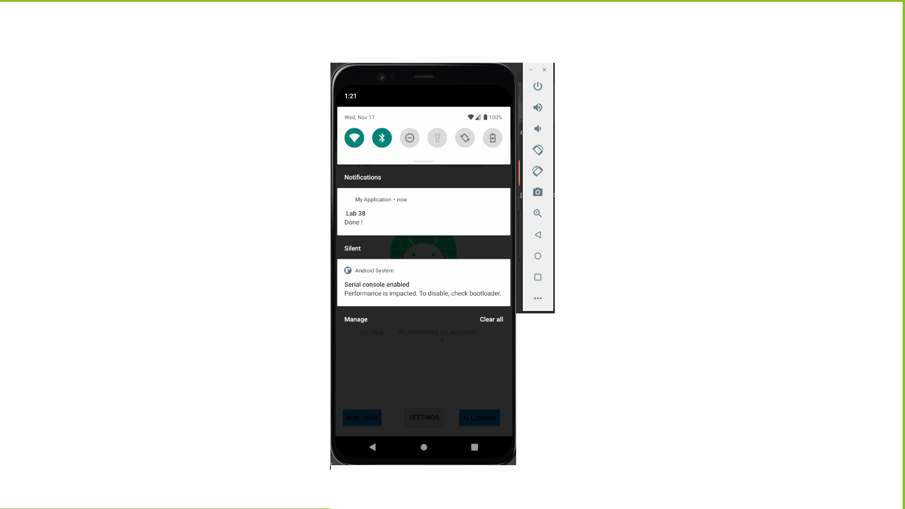
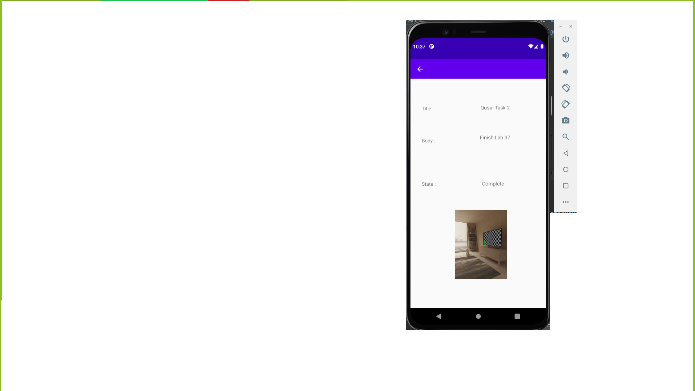
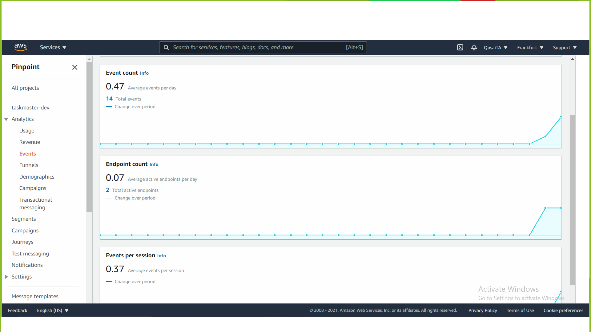

## description :

**this application consist of five Activities.**
- Main Activity : Contain 3 buttons.. Add Task,All Tasks,Recycler view,Settings.
- Add Task : Contain three input fields and one button that calculate the number of your tasks and save the data of the database.
- All Tasks : Contain an image.
- Task Details : Contain a 3 label for the title,body,state task and there bodies and there state.
- Settings : Contain an input for the username and save button

- Recycler view : move u to task details page and display the task

**Main Activity**

**Add Task Activity**

**All Tasks Activity**

**Task Details Activity**

**Settings Activity**

**AWS Working approval**

**Notification**

**S3 Storage**

**S3 Storage**

